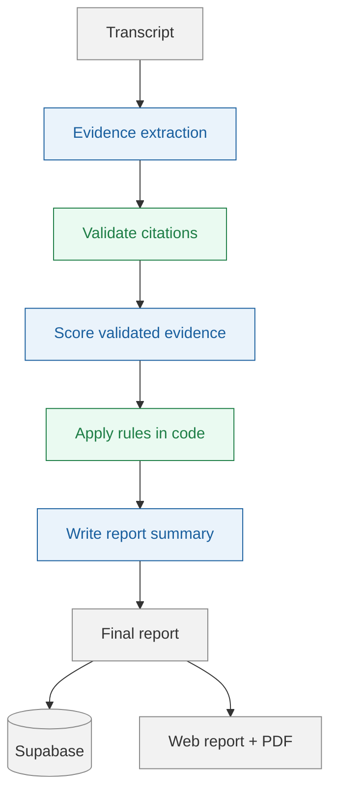

# Call Scorer

Paste a kickoff or coaching call transcript to get an evidence-backed score against BeaverMind's rubric, plus a shareable report, improvement priority, red flags, and downloadable PDF.

**Live:** https://call-scorer-inky.vercel.app
**Source spec** (reference only): [hiring-ai-dev-exercise](https://github.com/lukecala/hiring-ai-dev-exercise)

## How it works



Blue = LLM call, green = deterministic code.

1. **Extract evidence.** The transcript is indexed into numbered lines. A model identifies behaviour for each dimension and supplies `{ line, quote }` citations; scoring guidance is withheld at this stage.
2. **Validate it.** Code compares every citation with the real transcript text and removes anything that does not match.
3. **Score only verified evidence.** A separate model receives the rubric and the validated evidence—not the raw transcript—and produces dimension scores and quick fixes.
4. **Apply rules deterministically.** Code applies rubric caps, calculates totals and bands, and selects the highest-impact improvement.
5. **Create the summary.** A final, downstream model call writes the brief and red flags from the completed result. It cannot change scores, caps, or the selected improvement.

The pipeline runs server-side after the initial response, so closing the tab doesn't stop it, and the finished report is persisted to Supabase for the shareable link.

## Setup

Create `.env.local` in the project root:

```bash
ANTHROPIC_API_KEY=sk-ant-...

# Supabase -> Project Settings -> API
NEXT_PUBLIC_SUPABASE_URL=https://<project-ref>.supabase.co
SUPABASE_SERVICE_ROLE_KEY=<service_role secret>
```

Apply [`db/schema.sql`](./db/schema.sql) once in the SQL Editor for that Supabase project. The script is idempotent, so it is safe to run again.

`SUPABASE_SERVICE_ROLE_KEY` is server-only. The `runs` table has RLS enabled with no public policies, so the browser cannot read or write evaluation data directly.

## Run locally

```bash
npm install
npm run dev
```

Open [http://localhost:3000](http://localhost:3000), then paste, drop, or select a kickoff or coaching transcript.

```bash
npm test
npm run stage1 -- <kickoff|coaching> <path-to-transcript.txt>
npm run validate
npm run pipeline -- <kickoff|coaching> <path-to-transcript.txt>
```

`stage1` runs evidence extraction only; `validate` rechecks saved output without an API call; `pipeline` runs the full workflow without writing to the database.

## Design choices

- **Evidence before scoring.** A citation must match the transcript before it can influence a score - dimension evidence and cap-triggering signals alike. One honest limit: a citation can prove something happened, not that something never happened across a whole call - documented in [`ENGINEERING_LOG.md`](./ENGINEERING_LOG.md) rather than glossed over.
- **Rules stay in code.** Automatic caps, totals, bands, and the recommended improvement are deterministic—not model judgment.
- **Protected persistence.** Supabase is accessed only from server code using the service-role key; unauthenticated browser access is blocked by RLS.
- **Purpose-fit model use.** Sonnet handles evidence extraction and scoring; the cheaper Haiku model only produces the downstream report prose.
- **Rubric totals are derived from dimensions.** Coaching dimensions total 105 points despite conflicting numbers in the source scope note, so the app calculates the maximum from the actual rubric.
- **Caught by a system built to distrust the model.** A Stage 1 signal once contradicted its own dimension's validated evidence and wrongly zeroed a real score - fixed with a deterministic check that only trusts validated evidence, never a bare claim.
- **A bug only a live deployment could catch.** A function timeout that four phases of local-only testing never tripped, found and fixed against real production latency.
- **A bug found by reading the spec's "taste" requirement literally.** Actually rendering a real PDF, not just trusting the code, surfaced `85.55555555555556 / 100` on a D4-disabled coaching call - a repeating decimal from an unrounded rescale, never caught because most spot-checked runs don't rescale at all. Fixed at the one source function; every consumer inherits it.
- **The rubric's own "Scoring Principles" are wired into the prompt, checked against the source doc, not just the per-dimension tables.** Both rubrics state a cross-dimension client-feelings test - checked whether it actually reached the model and found it didn't; now it's rendered explicitly per rubric, alongside kickoff's more specific "don't collapse a full band" missing-evidence nuance.
- **`movementCoachingDisabled` gets the same evidence bar as any cap now.** It used to be the one significant model decision with zero citation-checking despite dropping an entire dimension from scoring - closed the same way Phase 11 closed it for caps, not with a manual override.
- **Deliberately out of scope:** concurrent double-submit races, and transcript formats other than the exercise's own `[Speaker]: text` shape.

For detailed implementation notes, trade-offs, and validation history, see [`ENGINEERING_LOG.md`](./ENGINEERING_LOG.md).
